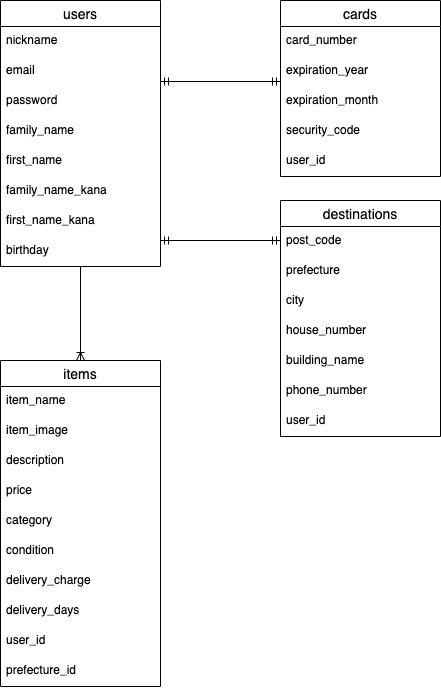

## ER図

## usersテーブル
|Column|Type|Options|
|------|----|-------|
|nickname|string|null: false|
|email|string|null:false, unique:true|
|password|string|null: false|
|family_name|string|null: false|
|first_name|string|null:false|
|family_name_kana|string|null: false|
|first_name_kana|string|null:false|
|birthday|date|null: false|

### Association
- has_many :items, dependent: :destroy
- has_many :oders, dependent: :destroy
- has_one :destination dependent: :destroy

## itemsテーブル
|Column|Type|Options|
|------|----|-------|
|name|string|null: false|
|description|text|null: false|
|price|integer|null: false|
|category|string|null:false|
|condition|string|null: false|
|delivery_charge|integer|null:false|
|delivery_days|integer|null: false|
|user|refarences|null:false, foreign_key:true|
|prefecture|refarences|null: false, foreign_key:true|

### Association
- belongs_to :user
- belongs_to_active_hash :prefecture

## destinationsテーブル
|Column|Type|Options|
|------|----|-------|
|post_code|integer|null: false|
|prefecture|integer|null:false|
|city|string|null: false|
|house_number|string|null: false|
|building_name|string|
|phone_number|integer|null: false|
|user|refarences|null:false, foreign_key:true|

### Association
- belongs_to :user

# odersテーブル
|Column|Type|Options|
|------|----|-------|
|user|refarences|null:false, foreign_key:true|
|item|refarences|null:false, foreign_key:true|

### Association
- belongs_to :user
